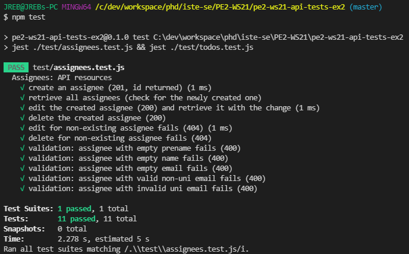
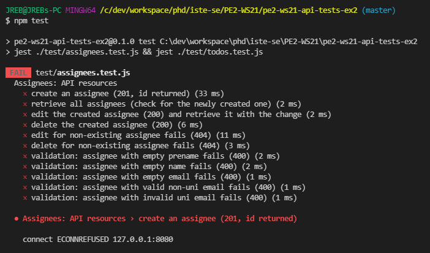

# PE2: API Tests for Exercise Sheet 2

> A Node.js test script to validate the functional correctness of the RESTful API required for exercise sheet 2 of the PE2 lecture

## Prerequisites

- Install Node.js.
- Clone or download this project to your local machine.
- Start your API with the correct path. The script expects the API base URL to be `http://localhost:8080/api/v1`. This can be changed in `./test/util.js` (`apiBasePath`), but please conform to this URL when submitting your final version (changeable in `api\src\main\resources\application.properties` --> `server.servlet.context-path`).
- The requests from the test script originate from `http://localhost:8000`, i.e. the same port as the frontend (CORS filter). So stop your frontend before starting the tests. This URL can be changed in `package.json` (`jest.testEnvironmentOptions.url`), but please enable `http://localhost:8000` for the CORS filter of your final version (`Application.java`).
- Install the necessary dependencies for the test script with `npm install`.

## Usage

**CAVEAT:** These test scripts create and delete data entries in your system.

```bash
# install dependencies
npm install

# run complete test suite sequentially
# (assignees --> todos)
npm test

# run only tests for assignee resources
npx jest ./test/assignees.test.js

# run only tests for todo resources
npx jest ./test/todos.test.js
```

## Result Examples

In case of **success**, the console will show an output similar to the following for each test script:



In case of **errors**, the console will show the failing test cases plus the exceptions that occurred during the execution, either unexpected ones (e.g. failed http request) or failed `expect()` matches:



For each exception, the associated line number will be highlighted, so use this to investigate which check fails during the test.
If the test suite produces errors (`npm test`), start with the first failing individual test script (`npx jest ./test/<name>.test.js`) and fix the errors.
Then continue with the next one until all tests pass.
Ensure that the script for `assignees` works before you try to fix the one for `todos`.
